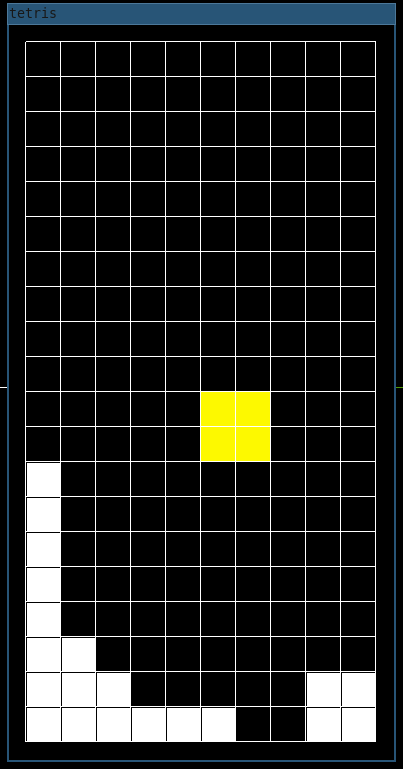

## Tetris

Simple tetris implemented in C.

You can build it with the following make command:
```
make -B
```

The first time can take some time because will build RayLib too.

After, you can just run the executable in with `./bin/tetris`.

